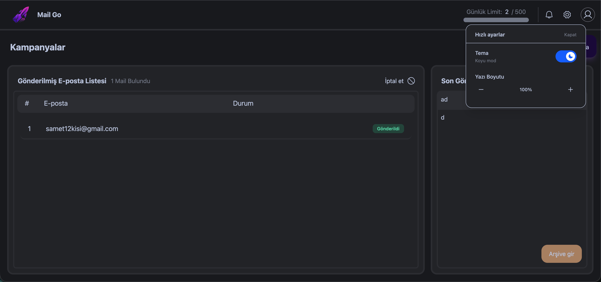
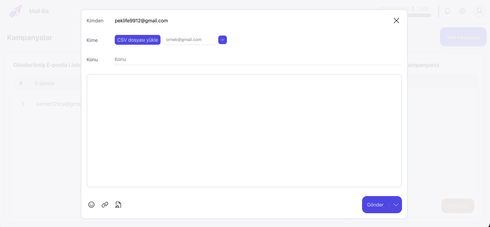
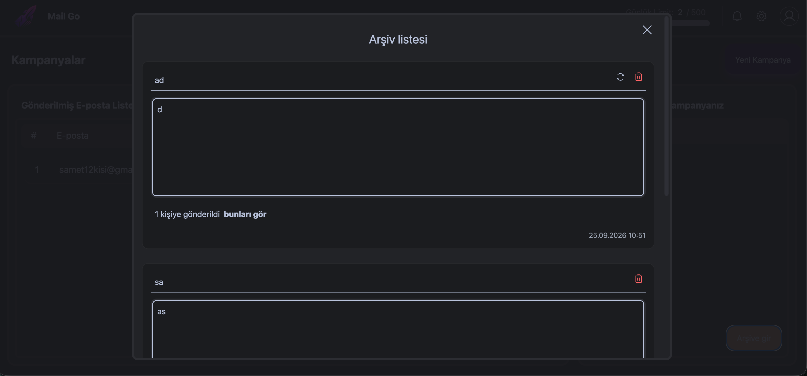

# 🚀 Mail Go

A bulk email campaign tool — upload a recipient list (or add emails manually), write one message, and send it to everyone with per-recipient delivery tracking.

**Live Demo:** [mail-go-nine.vercel.app](https://mail-go-nine.vercel.app/)

## ✨ Features

- Create a campaign: subject + rich message body, with emoji, link, and image insert options
- Add recipients by uploading a CSV file, or add emails manually one by one
- Live recipient count as you add addresses
- Per-recipient delivery status (e.g. "Gönderildi" / Sent) shown in a results table after sending
- Daily sending limit tracker (e.g. `2 / 500`) to stay within provider quotas
- Campaign archive — past campaigns are listed with their subject, body, how many recipients they reached, and the send date
- Resend or delete a campaign from the archive
- Quick settings panel: dark/light theme toggle and adjustable font size

## 🏗️ Tech Stack

> Fill this in with your actual stack — happy to update once you confirm:
- Frontend: React (assumed, based on your other projects) — confirm framework, styling, state management
- Backend / email sending: confirm framework (Express, etc.) and provider (Resend, Nodemailer + SMTP, SendGrid, etc.)
- Any database used to store campaigns/archive?

## 📸 Screenshots

| Campaigns Dashboard | New Campaign | Archive |
|---|---|---|
|  |  |  |

## ⚡ Getting Started

### Prerequisites
- Node.js 18+
- Credentials for your email sending provider

